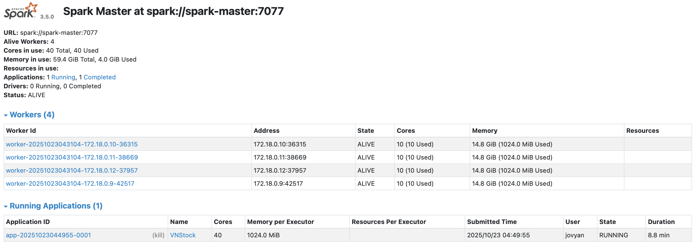

# Case Study: Stock Price Bigdata

A Big Data Analytics project focused on **Vietnamese Bank Stock Prices (VNStock)**.  
This project demonstrates a complete data pipeline — from data collection, preprocessing, Spark-based distributed processing, and Analysis.

---

## Objectives

- Explore topics related to **Big Data Analytics**.
- Apply data processing and analytical techniques.
- Build and deploy a **Big Data System** using **Spark + Docker + Jupyter**.
- Analyze and visualize stock price trends and growth rates.

---

## 📁 Dataset: VNStock – Bank Sector

| Symbol | Bank Name |
|:------:|:-----------|
| VCB | Vietcombank |
| BID | BIDV |
| CTG | Vietinbank |
| TCB | Techcombank |
| MBB | MBBank |
| ACB | Asia Commercial Bank |
| VPB | VPBank |
| HDB | HDBank |
| STB | Sacombank |
| SHB | SHB Bank |

Data Source: [VNStock Python Library](https://pypi.org/project/vnstock/)

---

## ⚙️ System Setup

### 1. Docker Cluster Configuration

| Component | Image | Description |
|------------|--------|-------------|
| Namenode | `bde2020/hadoop-namenode:2.0.0-hadoop3.2.1-java8` | HDFS Namenode |
| Datanode (x4) | `bde2020/hadoop-datanode:2.0.0-hadoop3.2.1-java8` | HDFS Datanodes |
| Spark Master | `spark:3.5.0` | Spark Control Node |
| Spark Workers (x4) | `spark:3.5.0` | Spark Executors |
| Jupyter Notebook | `jupyter/pyspark-notebook:latest` | Development Environment |

---

## 🔌 Connect to Spark Cluster


1. Start Docker containers and open **Jupyter logs**.  
2. Copy the generated token URL (e.g.):
http://127.0.0.1:8888/?token=19532747303c797297f96ede0547730daa5c77485ef26656
1. In **Visual Studio Code**:
- Go to **Select Kernel → Existing Jupyter Server**
- Paste the link (remove the `/lab` part if present)
1. Test connection with the code below:

```python
    from pyspark.sql import SparkSession

    spark = (
    SparkSession.builder
    .appName("VNStock")
    .master("spark://spark-master:7077")
    .config("spark.hadoop.fs.defaultFS", "hdfs://namenode:9000")
    .getOrCreate()
    )

    print("Spark connected:", spark.version)
```    

### Data Pipeline
1. Step 1️⃣ – Collect Data
Use the vnstock API to fetch historical price data for all selected bank stocks.
```python 
from vnstock import Vnstock
import os

DATA_PATH = './data'
SYMBOL_PATH = './data/symbol.txt'

symbols = [s.strip() for s in open(SYMBOL_PATH, 'r', encoding='utf-8')]

for s in symbols:
    print(f"Loading stock: {s}")
    stock = Vnstock().stock(symbol=s, source="VCI")
    df = stock.quote.history(start='2015-01-01', end='2025-01-01', interval='1D')
    df.to_csv(f'./data/stock/{s}.csv', index=False)
```

2. Step 2️⃣ – Upload Data to Cluster
- Store all collected .csv files in HDFS using the Spark cluster.
- Verify successful upload using Hadoop WebUI (localhost:9870).
3. Step 3️⃣ – Data Preprocessing
- Convert date → datetime
- Clean symbol strings (strip(), remove \t)
- Handle missing values (drop or interpolate)
4. Step 4️⃣ – Analysis
-  Price Trend
--  Plot closing price trends of all bank stocks.
- Price Growth Rate
-- Calculate 2-month growth rate and visualize changes.

## Results
Task	Result
Cluster Setup	Successfully deployed Spark + Hadoop + Jupyter via Docker
Data Collection	Collected 10 bank stock datasets (2015–2025)
Data Analysis	Generated trend and growth rate visualizations
Visualization	All analysis plots displayed in Jupyter and exported as .png
📦 Project Structure
```bash
📁 Project
│
├── data/
│   ├── symbol.txt
│   |
│   │── VCB.csv
│   │── BID.csv
│   │── ...
│── namenode/
|   |── init_namenode.sh # Init HDFS cluster
├── notebook/
│   ├── explore.ipynb # All processing
├── docker-compose.yml # Run docker compose up -d
├── core-site.xml # Config
├── hdfs-site.xml # Config
├── requirements.txt
├── README.md
└── report.pdf     ← report
```
## Technologies Used
- Python (pandas, matplotlib, tensorflow, pyspark)
- Apache Spark (3.5.0)
- Hadoop (HDFS) (3.2.1)
- Docker for containerized cluster deployment
- Jupyter Notebook for experimentation and visualization
- VNStock API for data collection
## Author
- Author: Bao-Trinh Tuan Ngoc
- Date: October 2025